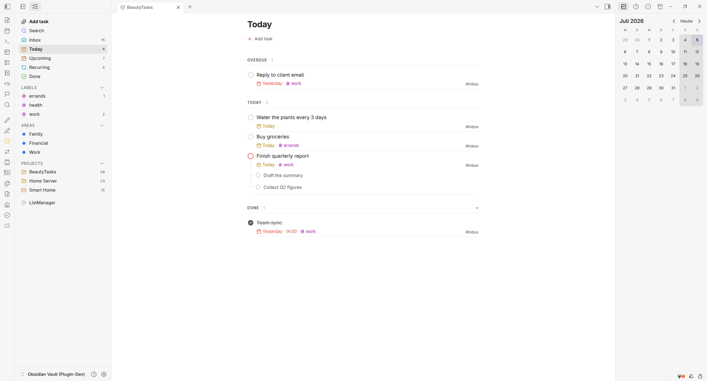
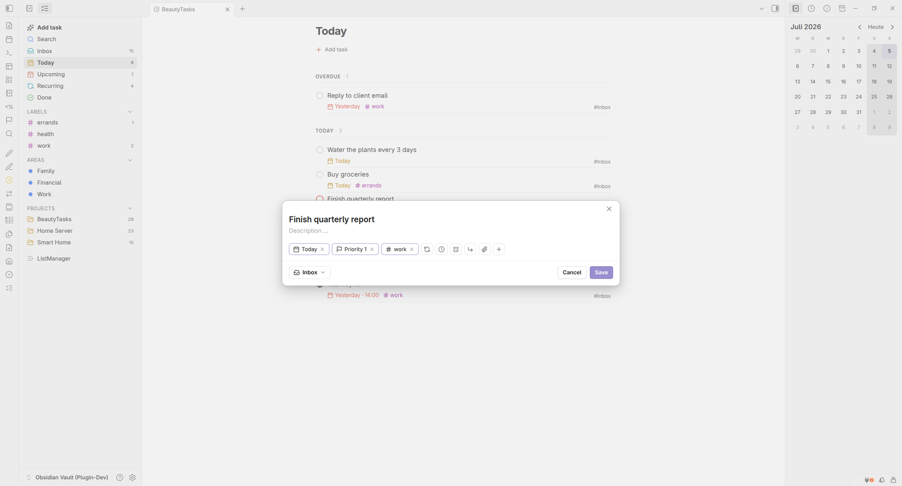
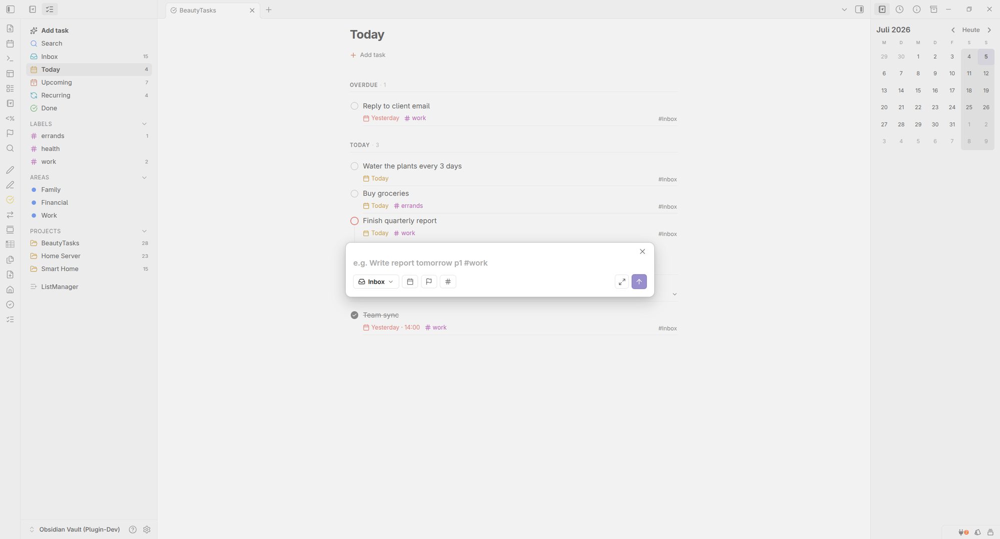
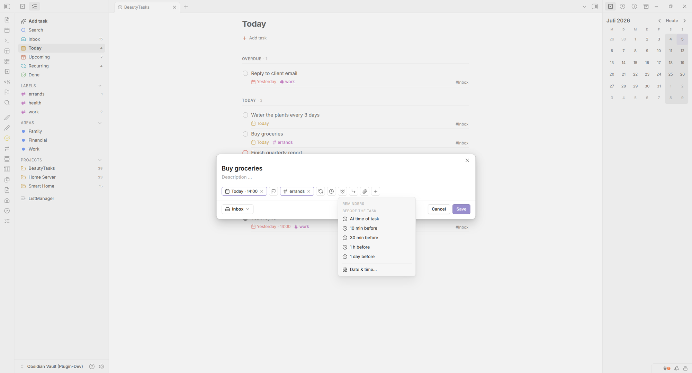

# BeautyTasks

A Todoist-style task & project manager that lives **inside** Obsidian — with a fast, native UI on top of plain Markdown. Every task is a single Markdown note, so your data stays open, portable and future-proof, and there are **no plugin dependencies** and no account required.


---

## Why BeautyTasks

- **One note per task.** Each task is a normal Markdown file with YAML frontmatter. Nothing is locked in a proprietary database — search it, edit it by hand, sync it, or version it with Git.
- **A real task app, natively.** A Todoist-inspired dashboard with sidebar navigation, a chip-based task editor, quick capture and keyboard-friendly flows — all rendered inside Obsidian, popout-window compatible.
- **Zero plugin dependencies, local-first.** No other plugin and no account required. Your tasks are plain Markdown in your vault — the one optional online feature is two-way **Google Calendar sync**, which stays off until you set it up.
- **Fully themeable.** Every color is a CSS variable; works with your theme, CSS snippets, or the Style Settings plugin — including a monochrome mode.
- **10 languages.** The interface is available in English, German, Spanish, Portuguese (Brazil), French, Italian, Turkish, Russian, Simplified Chinese and Japanese (auto-detected from Obsidian, or set in settings). Natural-language **dates and times** work in all of them except Turkish, where English keywords (`tomorrow`, `next monday`) still do. English keywords work in every language, alongside your own.

---

## Screenshots

### The dashboard
A Todoist-style dashboard with sidebar navigation and grouped task lists.



### Task editor
The full editor with its chip row for date, priority, labels, recurrence, deadline and reminders.



### Quick capture
Add tasks in plain language — dates, times, priority and `#labels` are parsed automatically.



### Reminders
Relative (“30 min before”) or absolute reminders, delivered as system notifications.



---

## Features

### Views & navigation
A single dashboard with a left sidebar:

- **Inbox** — everything without a project.
- **Today** — tasks due today (plus anything overdue).
- **Upcoming** — a forward-looking, date-sorted agenda.
- **Recurring** — all repeating tasks at a glance.
- **Done** — completed tasks, with a built-in **Trash** for soft-deleted items.
- **Projects, Areas, Labels & Filters** — collapsible sections in the sidebar; open any project, area or label as its own **list or Kanban board**.
- **Search** — fast fuzzy search across all tasks; jump straight to a task and highlight it in place.
- **Manage** — a ListManager with separate **Projects**, **Areas**, **Labels** and **Filters** tabs: create, rename, recolor, hide, archive or delete each, and restore or permanently remove trashed items.

Every sidebar entry has a **right-click menu** (edit, recolor, convert, hide, reorder, archive, delete), and you can **reorder** sections by drag or sort them **manually, by name or by task count**.

**Projects vs. Areas.** Organize tasks into **projects** or **areas** — two independent kinds, each with its own tab in the ListManager and its own `+` in the sidebar, so you can **create, archive and delete either one directly**. An **Area** is a fixed section that keeps its own place in the sidebar — ideal for long-running responsibilities that should never be “finished” — while a **project** is for work that eventually wraps up. You can convert one into the other at any time.

### Saved filters & smart views
Build custom queries — by project/area, label, priority, status, date range and more — and **save them to the sidebar** as reusable smart views, each with its own color. Per-view display options (grouping, sorting, show completed) are remembered.

### Kanban board
Any project, area or label board can switch between a **List** and a **Board** layout with a quiet toggle in its header. The board’s columns follow your **statuses** (which you can fully customize — see below), so you see your workflow at a glance:

- **Drag & drop** a card between columns to change its status instantly.
- **Group the board** by status, label, priority or project — not just status.
- **Reorder columns** by dragging their headers (saved per board), and add a task straight into a column with its `+`.
- Columns **stack vertically** on narrow panes and mobile, so the board stays usable on the phone.

Because columns map to the task’s `status` field, moving a card is just a normal edit to its Markdown note — nothing lives in a separate board file.

### Custom statuses
Define your own workflow beyond the built-in *To-Do · In progress · Done · Cancelled*. In *Settings → Statuses* you can **add, rename, reorder, recolor and change the icon** of statuses, grouped into three categories — **open · done · cancelled** — that drive behavior (completion timestamps, recurrence, trash). The in-progress state shows as a **half-filled checkbox** everywhere.

### Tasks & attributes
Each task can carry:

- **Status** — the built-in *To-Do · In progress · Done* (plus a *Cancelled* trash state), or your **own custom statuses**. Set one by **right-clicking** the checkbox (or **long-pressing** it on mobile), from the **status chip** in the task editor, or by dragging on the Kanban board — a left-click still simply completes the task.
- **Priority** (highest → lowest) with colored checkbox rings (P1/P2/P3).
- **Due date & time** and an optional **duration** (event length).
- A separate **deadline / scheduled** date & time.
- **Project** and **Area** assignment.
- **Sub-tasks** — nest tasks under a parent, drawn with clean connector lines.
- **Labels** (`#tags`).
- **Recurrence** — “every day / week / 3 months …”, repeating from either the **due date** or the **completion date**.
- **Reminders** — get notified before or at a task’s time (see below).
- A **Markdown description**, a **timestamped comment log**, and **file/image attachments** (see below).

### Quick capture with natural language
Add tasks at the speed of thought. The quick-add modal understands plain sentences:

> `Write report tomorrow p1 #work`
> `Bericht schreiben morgen um 07:30 #arbeit`
> `Escribir informe mañana #importante`

**Dates and times** are understood in your interface language — English, German, Spanish, Portuguese, French, Italian, Russian, Chinese and Japanese. English keywords work everywhere, alongside your own, so `Escribir informe tomorrow` is fine too. Turkish has no date parser yet; there, English keywords are the way.

Everything else in the table below is the same in every language: **recurrence** is written in English or German (`every day`, `jeden Tag`), and `p1`, `#label` and `@project` are symbols, not words.

Recognized tokens are stripped from the title automatically:

| What | Examples |
| --- | --- |
| **Date** | `today`, `tomorrow`, `day after tomorrow`, `in 3 days`, `next week`, `next monday`, a bare weekday (`friday`), `3 Jul` / `July 3rd`, `20.06.2026`, `06/20/2026`, `2026-06-20` |
| **Time** | `at 7:30`, `7:30`, `7pm`, `at 7`, `um 20.15`, `um 2015` (four digits and the dot form need `at`/`um` in front — otherwise `Sort photos from 2015` would become a time) |
| **Recurrence** | `every day`, `daily`, `every week`, `weekly`, `every 3 days`, `every 2 weeks`, `every 3 months`, `yearly` |
| **Priority** | `p1`–`p4` or `!1`–`!4` |
| **Label** | `#work` — any label, created on the fly |
| **Project** | `@project` — existing projects and areas only |

A time or a recurrence without a date is anchored to **today**: a time needs a day to be shown and saved, and a recurrence without a date would never come back.

**Not recognized** (use the chips instead): reminders, duration, start date, status and parent.

#### When a word should stay text

Writing `Today's plan` and getting the word swallowed as a date is annoying. Two ways out — and both are the same thing under the hood:

- **Click the ✕ on the chip.** The recognized value goes away, the word returns to the title. This is the easy path; you don't need to know any syntax.
- **Type it yourself.** `\word` protects a single word — the same backslash escape Markdown uses, and the backslash disappears from the title. `"a whole phrase"` protects several words at once; the quotation marks stay, because they're your punctuation, not syntax.

```
\Today I go swimming      → title "Today I go swimming", no date
Book "Der Prozess" today  → title kept as typed, due today
every \monday standup     → title "every monday standup", no recurrence
```

The ✕ simply writes that backslash for you: `Dentist tomorrow` → ✕ → `Dentist \tomorrow`. Because the escape lives in the text, it survives — and typing a new date word afterwards is recognized again.

Prefer full control? Open the Todoist-style task editor with its chip row for date, priority, labels, recurrence, deadline, reminder and parent — and **show, hide or reorder those chips** to taste (separately for quick add and the full editor).

### Reminders
Attach one or more reminders to a task — either **relative** (“at time of task”, 10 min / 30 min / 1 h / 1 day before) or an **absolute** date & time. When a reminder is due, BeautyTasks shows a **system notification** on desktop (even when Obsidian is in the background) and an in-app notice; clicking it opens the task.

> **Good to know:** in-app reminders fire while Obsidian is running (on desktop that includes the background; on mobile while the app is open). To be notified even when Obsidian is **fully closed**, turn on **Google Calendar sync** — reminders are pushed onto the calendar event, so your phone or OS notifies you. A standalone `.ics`/VALARM export is also on the roadmap.

### Notes, comments & attachments
Every task has a **Details** panel for the story behind the task:

- A free-form **Markdown description**.
- A **timestamped comment log** to track progress over time — add, edit and revisit notes, each stamped with its date and time.
- **Attachments** — click the paperclip, or simply **paste or drag & drop** files and images straight into a comment. They’re saved to your configurable attachments folder, and images appear as thumbnails with a built-in **lightbox** (zoom, copy to clipboard).
- **Link other notes** into a comment to connect related context from your vault.

Because it all lives in the task note’s own Markdown body, your comments and attachments stay readable and portable outside the plugin, too.

### Everyday conveniences
- **Recolor & organize** projects, areas, labels and filters — set a color, convert a project ↔ area, hide, reorder or archive, all from the right-click menu or the Manage screen.
- **Duplicate** a task, **copy a deep link** (`obsidian://`) to it, or **print** a clean copy.
- **Soft delete** to Trash, then restore or empty it — nothing is lost by accident (Trash and Done are ordered newest-first).
- **Export & import all tasks as JSON** — a lossless backup of your task data (fields and description) that you can restore or move to another vault. Import from within the vault or from a file on disk; re-importing is **idempotent** (existing tasks are matched by id and skipped), and missing projects, areas and labels are recreated. Attachments and the comment log stay as separate files in your vault (back them up with the folder).
- **Import from TaskNotes** — migrate tasks from the TaskNotes plugin (non-destructive, idempotent), or import existing checkboxes from the Tasks/Lists format.
- **Icons-only chips** for a more compact editor, and an optional **description preview** under task titles in lists.
- Localized in **10 languages**, mobile-friendly, and **popout-window compatible**.

---

## Getting started

1. Install BeautyTasks and enable it.
2. Click the **check-circle** ribbon icon (or run **“Open BeautyTasks”**) to open the dashboard.
3. Hit **Add task** / run **Quick add**, type something like `Buy milk tomorrow #errands`, and press Enter.

That’s it — a new Markdown note is created for the task in your configured folder.

## How your data is stored

Every task is a Markdown note with frontmatter. Nothing proprietary:

```yaml
---
type: task
id: t-8f3a1
status: todo            # todo | doing | done | cancelled
priority: high
due: 2026-07-10T09:00
scheduled: 2026-07-08
duration: 30            # minutes
project: "[[Website Relaunch]]"
parent: "[[Draft the outline]]"
labels: [work, writing]
recurrence: every week
recur_basis: due        # due | done
reminders: ["-30m", "2026-07-10T08:00"]
created: 2026-07-04
---

# Write the launch blog post

Free-form Markdown description here…
```

By default, notes live under these folders (all configurable in settings):

| Content | Default folder |
| --- | --- |
| Tasks | `BeautyTasks/Items` |
| Projects & Areas | `BeautyTasks/Projects` |
| Saved filters | `BeautyTasks/Filters` |
| Attachments | `BeautyTasks/Attachments` |

Projects and areas are the same kind of note (`type: project` / `type: area`), so they share one folder.

## Google Calendar sync

BeautyTasks can mirror every task that has a **due date** into Google Calendar, two-way: the **date and time** flow in both directions, while everything else (title, duration, reminders) is driven by Obsidian. It uses **your own** Google API credentials — no third-party server is involved, and your token stays in your vault.

### Setup (one-time, ~5 min)

1. **Project** — open the [Google Cloud Console](https://console.cloud.google.com) and create or pick a project.
2. **Enable the API** — go to *APIs & Services → Library*, search for **Google Calendar API**, and click **Enable**.
3. **Consent screen** — open *Google Auth Platform → Get started*: set an app name and your email, and choose **Audience = External**. Then open **Audience** and **Publish app** so the status is **In production**.
   > ⚠️ **Important:** In *Testing* mode, refresh tokens for calendar scopes expire after **7 days**, so the sync would break every week. *In production* they stay valid. You do **not** need Google to verify the app while you are the only user.
4. **Create the client** — go to *Clients → Create client*, set Application type to **Desktop app**, click **Create**, then copy the **Client ID** and **Client secret**.
5. **Connect** — in Obsidian open *Settings → BeautyTasks → Google Calendar*, paste the Client ID and secret, and click **Connect**. On the “Google hasn’t verified this app” screen choose **Advanced → Continue** — this is expected for a personal app.
6. **Calendar** — BeautyTasks creates and selects a dedicated **“BeautyTasks”** calendar (small blast radius; your other calendars are never touched). Done.

The required permissions (`calendar.events`, `calendar.readonly`, `calendar.app.created`) are requested when you connect — there is nothing to pre-register in the consent screen. On **mobile**, step 5 uses a device-code login (you enter a short code on another device) instead of the desktop loopback flow.

### What syncs

| Field | Obsidian → Google | Google → Obsidian |
| --- | --- | --- |
| Title | ✅ | — (Obsidian wins) |
| Date / time (`due`) | ✅ | ✅ written back |
| Duration | ✅ | — |
| Reminders | ✅ (as popups) | — |

- On a conflict (both sides changed the date), **Obsidian wins**.
- Existence is Obsidian-driven: an event deleted in Google is recreated as long as the task still has a date. To remove it for good, change the task in Obsidian or exclude its list.
- Exclude a project/area from sync via its right-click menu, the icon in the management list, or the edit dialog.

### Where credentials live

Your Client ID/secret and the OAuth token are stored locally in `.obsidian/plugins/beautytasks/data.json` (git-ignored). **Disconnect** in settings revokes the token with Google and deletes it locally. If you sync your vault by other means (Obsidian Sync, Dropbox, iCloud…), this file travels with it.

## Commands

| Command | What it does |
| --- | --- |
| Open BeautyTasks | Open the dashboard |
| Open Today / Upcoming / Recurring / Done | Jump straight to a view |
| New task | Open the full task editor |
| Quick add task | Fast natural-language capture |
| Search tasks | Fuzzy search |
| Count tasks | Show total / open count |
| Export tasks (JSON) | Save all tasks to a JSON file in your vault |
| Import tasks (JSON) | Restore tasks from a JSON export |
| Import from TaskNotes | Migrate tasks from the TaskNotes plugin |
| Import from Tasks/Lists | Migrate existing checkbox tasks |
| Sync with Google Calendar now | Run a calendar sync on demand |
| Show what’s new | Open the release highlights |

Assign hotkeys to any of these under **Settings → Hotkeys**.

## Settings

- **Folders** for tasks, projects and attachments.
- **Language** — auto (follow Obsidian) or pick one of 10 languages (English, German, Spanish, Portuguese, French, Italian, Turkish, Russian, Simplified Chinese, Japanese).
- **Start view** — which view opens by default (or the last used one).
- **Natural-language parsing** — toggle date/label/priority detection in titles.
- **Task actions (chips)** — show, hide and reorder the attribute chips, separately for quick add and the full editor.
- **Statuses** — add, rename, reorder, recolor and re-icon your workflow statuses.
- **Icons-only chips** and **description preview in lists**.
- **Google Calendar** — connect your account, choose the target calendar and sync options (see above).
- **Import & Export** — JSON backup/restore, plus import from TaskNotes or the Tasks/Lists format.

---

## Theming

BeautyTasks is fully themeable through CSS custom properties. It ships with a built-in color palette (separate values for dark and light mode, defined on `.theme-dark` / `.theme-light`). Everything is overridable, so you can adapt it to any theme.

### 1. Style Settings plugin (color pickers, no CSS)

If you have the community plugin **Style Settings** installed, open its tab and you’ll find a **BeautyTasks → Colors** section with color pickers for the semantic colors (overdue, due today, recurring, labels, priorities). These also drive the icon colors. Nothing is required in BeautyTasks itself — without Style Settings the defaults simply apply. A **Monochrome (no colors)** toggle at the top renders everything in the text color and overrides the pickers.

### 2. A CSS snippet (full control)

Create a snippet under *Settings → Appearance → CSS snippets* and override any of the variables:

```css
body {
  --bt-overdue: #e05c4a;        /* overdue tasks & priority-1 ring */
  --bt-add:     #e05c4a;        /* the "+" of Add task / project / subtask */
  --bt-today:   #f97316;        /* tasks due today (also the Today sidebar icon) */
  --bt-recur:   #ec4899;        /* recurring (also the Recurring sidebar icon) */
  --bt-label:   #a855f7;        /* labels (also the Labels sidebar icon) */
  --bt-prio-1:  #ef4444;        /* priority 1 (highest) checkbox ring */
  --bt-prio-2:  #f59e0b;        /* priority 2 (high) */
  --bt-prio-3:  #3b82f6;        /* priority 3 (medium) */
  --bt-sched:   var(--text-muted);   /* deadline / scheduled chip */
  --bt-line:        rgba(255, 255, 255, 0.10);  /* section dividers */
  --bt-line-faint:  rgba(255, 255, 255, 0.05);  /* task-row dividers */
}
```

Colors deliberately live in CSS variables (not in the plugin’s own settings) so themes, snippets and Style Settings can all drive them.

**Left sidebar icon colors** are themeable too. Each board has its own variable — `--bt-nav-search`, `--bt-nav-inbox`, `--bt-nav-heute`, `--bt-nav-demnaechst`, `--bt-nav-wiederkehrend`, `--bt-nav-erledigt`, `--bt-nav-manage` — and the item groups share one each: `--bt-nav-label`, `--bt-nav-area`, `--bt-nav-project`. For consistency, icons that also have a task chip default to the chip color (e.g. `--bt-nav-heute` → `--bt-today`).

### Per-project / per-area icon color

Individual projects, areas, labels and filters can have their own color. Pick one from the **color dot** in *Manage*, or from the **edit dialog** (right-click a sidebar entry → *Edit*). For projects and areas you can also set a `color:` property directly in the note’s frontmatter, e.g. `color: "#4caf50"`.

---

## Roadmap

BeautyTasks is under active development. The following are **planned and not yet available** — listed here so you know where it’s headed:

- **Sync** — a first-class way to keep tasks in sync across devices.
- **Reminders that survive a closed app** — `.ics` (VALARM) export so your OS or phone notifies you even when Obsidian isn’t running (pairs with Sync).
- **Calendar view** — see due/scheduled tasks on a month/week grid.
- **Task templates** — create recurring structures and checklists from reusable templates.

Have an idea or a request? Open an issue — feedback shapes the priorities.

---

## Support & feedback

Found a bug or want a feature? Please [open an issue](https://github.com/avnibilgin/BeautyTasks/issues). Contributions and suggestions are welcome.

## License

Released under the [MIT License](LICENSE).
